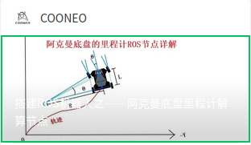
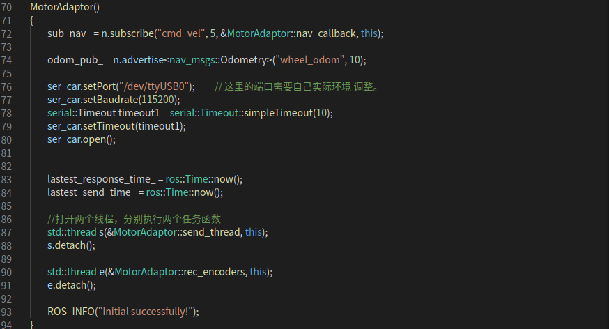

# Neor_mini_ROS_Tutorials

## Chapter 1 : Ackerman mobile base odometer node tutorial

#### Corresponding WeChat article




Step 1 : Download neor_mini/Neor_min_ROS_Tutorials/mini_motor_adaptor/ ROS example node.

```bash
# open a terminal
git clone https://github.com/COONEO/neor_mini.git 
 
 # copy mini_motor_adaptor ROS node in your ROS workspace_folder/src 
cd neor_mini/Neor_min_ROS_Tutorials/
cp -r mini_motor_adaptor/  your workspace/src/
```


Step 2 : Check your STM32 (or other Mirocontroller chip) Port in your PC

```bash
# open a terminal 
ls /dev

# remember your device name ,P.S. ttyUSB* 
```


Step 3 : check the "mini_motor_adaptor/src/mini_motor_adaptor_node.cpp" file and Revise ser_port.port()



P.S. remember save your corrections.

Step 4 : Running the mini_motor_adaptor ROS node.

```bash
# open a terminal and inside in your ROS workspace folder
cd your ROS workspace folder
catkin_make
source devel/setup.bash
sudo chmod 0777 /dev/ttyUSB*      # replace your port name
roslaunch mini_motor_adaptor mini_motor_adaptor.launch
```


If your node launch success,it will subscribe the ”cmd_vel“ velocity Topic and publish the "wheel_odom" odometry Topic.

