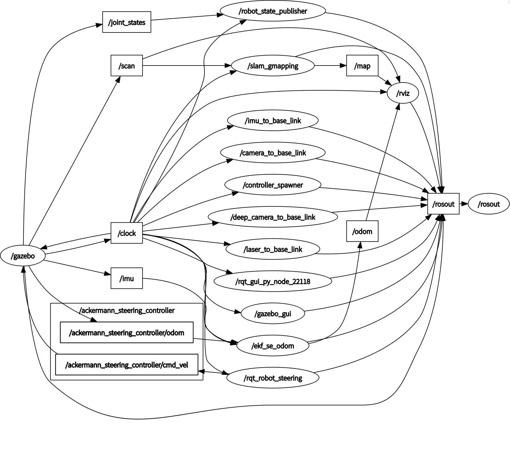
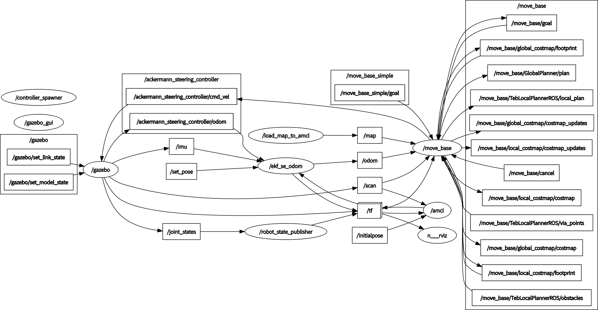
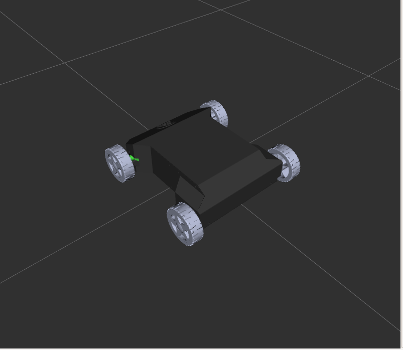
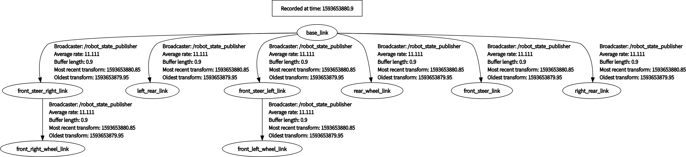
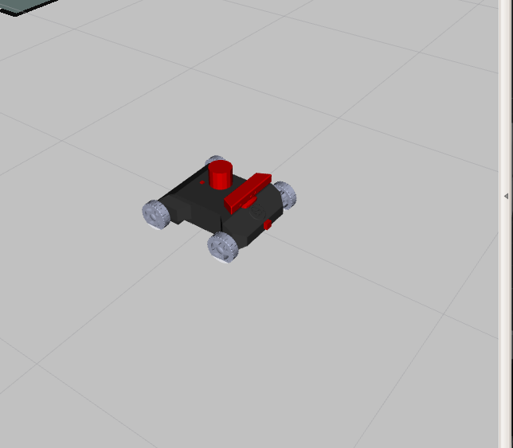
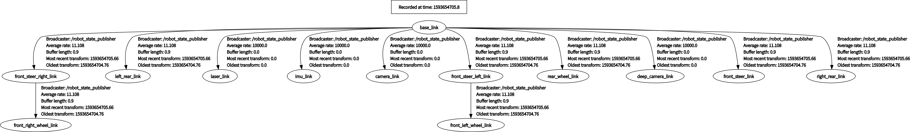
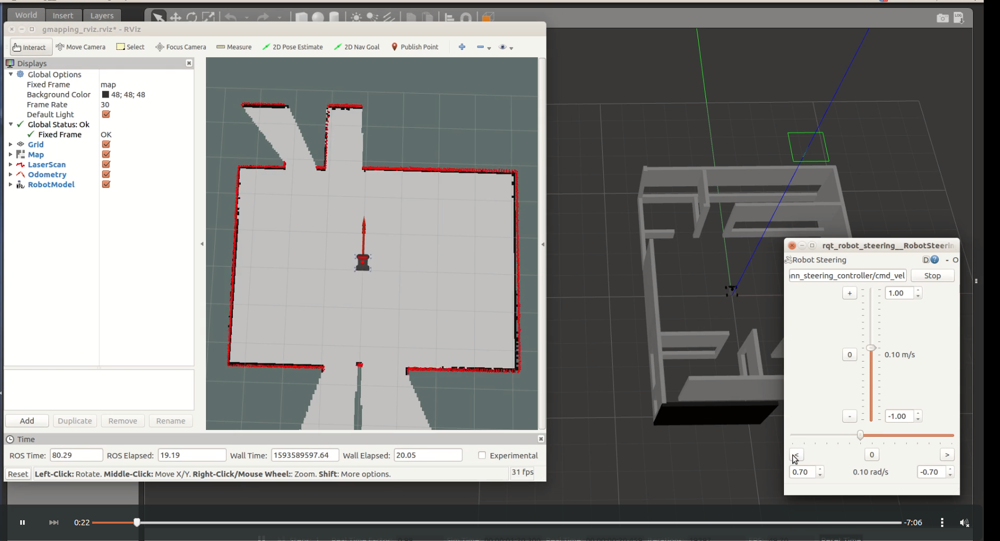
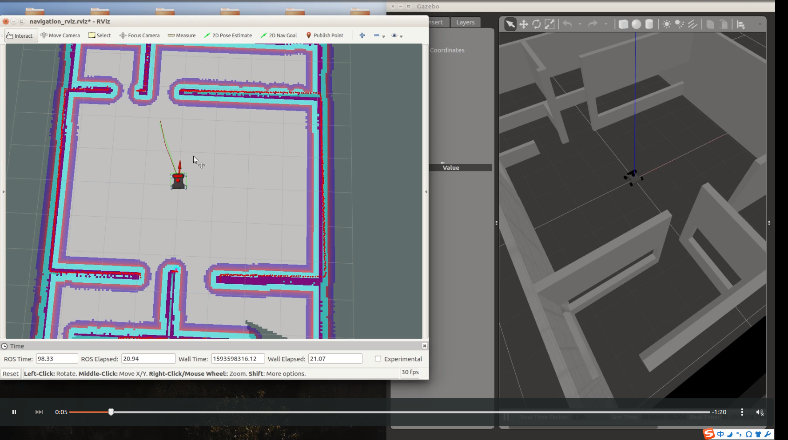

## 一、简介

# ROS kinetic 版本，适配 ubuntu ROS kinetic，clone前，请核对自己的ROS 版本哟

### 1、需要安装的功能包

```yaml
#安装插件
sudo apt-get install ros-kinetic-ackermann-steering-controller  
#安装建图功能包
sudo apt-get install ros-kinetic-gmapping 
#安装导航功能包
sudo apt-get install ros-kinetic-navigation
#安装局部规划算法功能包
sudo apt-get install ros-kinetic-teb-local-planner
# 安装gazebo仿真功能包
sudo apt-get install ros-kinetic-gazebo-ros*
# 安装机器人urdf关节发布及控制功能包
sudo apt-get install ros-kinetic-joint-state-controller
# 安装阿克曼 Qt界面控制插件
sudo apt-get install ros-kinetic-rqt-robot-steering
# 安装 gazebo_ros_control
sudo apt-get install ros-kinetic-gazebo-ros-control
.....
```

### 2、Gmapping建图原理简介

​		”[ackermann_steering_controller](http://wiki.ros.org/action/fullsearch/ackermann_steering_controller?action=fullsearch&context=180&value=linkto%3A"ackermann_steering_controller")“插件的功能是将ROS中的速度Topic类型“ [geometry_msgs/Twist ](http://docs.ros.org/melodic/api/geometry_msgs/html/msg/Twist.html)”数据中基于某点的线速度和角速度转换成阿克曼运动方式底盘的后轮线速度和前轮转向角度。并且根据底盘的后轮线速度和前轮转向角度，计算小车的里程计Topic类型“[nav_msgs/Odometry](http://docs.ros.org/melodic/api/nav_msgs/html/msg/Odometry.html)”消息，以及odom到base_link的tf转换。

​		有了上述的里程计信息和tf转换信息之后，再添加一个激光雷达信息，就可以借助Gmapping生成平面栅格地图了。但是在实际的运行过程中发现ackermann_steering_controller插件发布的odom话题数据不太稳定，会出现偶尔中断的情况，所以就又添加了imu话题数据。然后利用“[robot_localization](http://wiki.ros.org/robot_localization)”功能包的“**ekf_se_odom**”融合odom和imu话题，该功能包会发布融合后的里程计话题“odom”和tf转换。最终由Gmapping订阅该话题和tf转换，发布平面栅格地图信息“map”。节点间数据流关系图如下：



打开新的终端，进入你想保存的目录，输入如下命令保存栅格地图：

```
rosrun map_server map_saver -f map_name
```


### 3、定点导航工作原理

​		有了前面建立的栅格地图之后，就可以基于该静态地图进行全局路径规划了。ROS官方提供了基于两轮差速模型的定点导航规划框架“[move_base](http://wiki.ros.org/move_base)”，但是这里使用的是类似汽车转向的阿克曼模型，所以需要更换move_ base中的局部路径规划算法为：“[teb_local_planner](http://wiki.ros.org/action/fullsearch/teb_local_planner?action=fullsearch&context=180&value=linkto%3A"teb_local_planner")”，这样才能规划出更加适配阿克曼模型运动的速度值。整个导航功能节点间数据流图如下：




### 4、传感器数据仿真

​		（1）前面提到了激光雷达数据、imu数据，我们在使用urdf模型仿真的时候，由于没有使用真正的雷达，imu模块，所以只能借助仿真平台来模拟发布传感器数据信息，这里使用仿真平台Gazebo来完成这一功能。实现方式主要是利用Gazebo提供的面向ROS的传感器仿真插件来实现，如:[ROS Motor and Sensor Plugins](http://gazebosim.org/tutorials?tut=ros_gzplugins),其中有现成的imu、camera、deep_camera、laser、motor等插件模拟真实的情况。在这里介绍如何在cooneo_mini/urdf/文件夹中的.urdf文件中添加相关传感器插件。

​		本文档提供的cooneo_mini ROS功能包是由真实的设计图纸，利用solidworks + urdf expoter导出来的。其初始样子如下：



​		其tf树如下：



​		（2）为了提升观看效果和方便后续添加传感器仿真插件，在此基础上添加了摄像头(方块)、imu(方块)、激光雷达(圆柱)、深度相机(模型)。可参考配置好的：cooneo_mini/urdf/cooneo_mini.urdf，这里将添加方法描述如下：

```xml
<?xml version="1.0" encoding="utf-8"?>
<!-- This URDF was automatically created by SolidWorks to URDF Exporter! Originally created by Stephen Brawner (brawner@gmail.com) 
     Commit Version: 1.5.1-0-g916b5db  Build Version: 1.5.7152.31018
     For more information, please see http://wiki.ros.org/sw_urdf_exporter -->
<robot
  name="cooneo_mini">
  ......
  <!--将下述的标签文件复制到cooneo_mini.urdf 中即可 -->  
  <!--  手动添加激光雷达模型 -->
  <link name="laser_link">
    <visual>
      <geometry>
        <cylinder length="0.08" radius="0.05"/>
      </geometry>
    </visual>
  </link>
  <joint name ="2Dlaser_joints" type="fixed">
    <origin xyz="0.0 0.0 0.20" rpy="0.0 0.0 0.0"/>
    <parent link="base_link"/>
    <child link="laser_link"/>
  </joint>
  <!--*********************************************************************-->
 
  <!--  手动添加深度摄像头模型  -->
  <link name="deep_camera_link">
    <visual>
      <geometry>
        <mesh filename="package://cooneo_mini/meshes/kinect_Link.STL"/> <!--加载模型-->
      </geometry>
    </visual>
  </link>
  <joint name ="deep_camera_joints" type="fixed">
    <origin xyz="0.10 0.0 0.17" rpy="-1.57 0.0 -1.57"/>
    <parent link="base_link"/>
    <child link="deep_camera_link"/>
  </joint>
  <!--*********************************************************************-->

 <!--  手动添加摄像头模型   -->
  <link name="camera_link">
    <visual>
      <geometry>
        <box size="0.03 0.03 0.03"/>   <!--自定义模型样式 -->
      </geometry>
    </visual>
  </link>
  <joint name ="camera_joints" type="fixed">
    <origin xyz="0.23 0.0 0.05" rpy="0.0 0.0 0.0"/>
    <parent link="base_link"/>
    <child link="camera_link"/>
  </joint>
  <!--*********************************************************************-->

  <!--  手动添加imu模型   -->
  <link name="imu_link">
    <visual>
      <geometry>
        <box size="0.015 0.015 0.007"/>
      </geometry>
    </visual>
  </link>
  <joint name ="imu_joints" type="fixed">
    <origin xyz="-0.10 0.0 0.12" rpy="0.0 0.0 0.0"/>
    <parent link="base_link"/>
    <child link="imu_link"/>
  </joint>
  <!--*********************************************************************-->
  </robot>
```

 加载之后的样子和tf树如下：






​		（3）在上面的基础上继续添加传感器仿真插件，每个插件的reference link匹配你想绑定的Link name即可。涉及到的仿真插件如下：详情可参见coonoe_mini/urdf/cooneo_mini_sensors_gazebo.urdf文件

```xml
 <!-- 手动添加深度相机仿真插件 -->
  <gazebo reference="deep_camera_link">
    <sensor name="deep_camera" type="depth">
      <update_rate>20</update_rate>
      <camera>
        <horizontal_fov>1.047198</horizontal_fov>
        <image>
          <width>640</width>
          <height>480</height>
          <format>R8G8B8</format>
        </image>
        <clip>
          <near>0.05</near>
          <far>3</far>
        </clip>
      </camera>
      <plugin name="deep_camera_controller" filename="libgazebo_ros_openni_kinect.so">
        <baseline>0.2</baseline>
        <alwaysOn>true</alwaysOn>
        <updateRate>1.0</updateRate>
        <cameraName>/deep_camera</cameraName>
        <imageTopicName>/deep_camera/image_raw</imageTopicName>
        <cameraInfoTopicName>/deep_camera/color/camera_info</cameraInfoTopicName>
        <depthImageTopicName>/deep_camera/depth/image_raw</depthImageTopicName>
        <depthImageInfoTopicName>/deep_camera/depth/camera_info</depthImageInfoTopicName>
        <pointCloudTopicName>/deep_camera/depth/points</pointCloudTopicName>
        <frameName>deep_camera_link</frameName>
        <pointCloudCutoff>0.5</pointCloudCutoff>
        <pointCloudCutoffMax>3.0</pointCloudCutoffMax>
        <distortionK1>0.00000001</distortionK1>
        <distortionK2>0.00000001</distortionK2>
        <distortionK3>0.00000001</distortionK3>
        <distortionT1>0.00000001</distortionT1>
        <distortionT2>0.00000001</distortionT2>
        <CxPrime>0</CxPrime>
        <Cx>0</Cx>
        <Cy>0</Cy>
        <focalLength>0</focalLength>
        <hackBaseline>0</hackBaseline>
      </plugin>
    </sensor>
  </gazebo>
  <!--*********************************************************************-->

  <!-- 手动添加camera仿真插件 -->
  <gazebo reference="camera_link">
    <sensor type="camera" name="camera1">
      <update_rate>30.0</update_rate>
      <camera name="head">
        <horizontal_fov>1.3962634</horizontal_fov>
        <image>
          <width>800</width>
          <height>800</height>
          <format>R8G8B8</format>
        </image>
        <clip>
          <near>0.02</near>
          <far>300</far>
        </clip>
        <noise>
          <type>gaussian</type>
          <mean>0.0</mean>
          <stddev>0.007</stddev>
        </noise>
      </camera>
      <plugin name="camera_controller" filename="libgazebo_ros_camera.so">
        <alwaysOn>true</alwaysOn>
        <updateRate>0.0</updateRate>
        <cameraName>/camera1</cameraName>
        <imageTopicName>image_raw</imageTopicName>
        <cameraInfoTopicName>camera_info</cameraInfoTopicName>
        <frameName>base_link</frameName>
        <hackBaseline>0.07</hackBaseline>
        <distortionK1>0.0</distortionK1>
        <distortionK2>0.0</distortionK2>
        <distortionK3>0.0</distortionK3>
        <distortionT1>0.0</distortionT1>
        <distortionT2>0.0</distortionT2>
      </plugin>
    </sensor>
  </gazebo>
  <!--*********************************************************************-->

  <!-- 手动添加深激光雷达仿真插件 这里适配 rplidar A1M8 -->
  <gazebo reference="laser_link">
    <sensor type="ray" name="head_laser_sensor">
      <pose>0 0 0 0 0 0</pose>
      <visualize>false</visualize>
      <update_rate>40</update_rate>
      <ray>
        <scan>
          <horizontal>
            <samples>720</samples>
            <resolution>1</resolution>
            <min_angle>-3.1415926</min_angle>
            <max_angle>3.1415926</max_angle>
          </horizontal>
        </scan>
        <range>
          <min>0.01</min>
          <max>12.0</max>
          <resolution>0.01</resolution>
        </range>
        <noise>
          <type>gaussian</type>
          <mean>0.0</mean>
          <stddev>0.01</stddev>
        </noise>
      </ray>
      <plugin name="gazebo_ros_head_laser_controller" filename="libgazebo_ros_laser.so">
        <topicName>/scan</topicName>
        <frameName>laser_link</frameName>
      </plugin>
    </sensor>
  </gazebo>
  <!--*********************************************************************-->

  <!-- 手动添加imu仿真插件  -->
  <gazebo reference="imu_link">
    <gravity>true</gravity>
    <sensor name="imu_sensor" type="imu">
      <always_on>true</always_on>
      <update_rate>100</update_rate>
      <visualize>true</visualize>
      <topic>__default_topic__</topic>
      <plugin filename="libgazebo_ros_imu_sensor.so" name="imu_plugin">
        <topicName>imu</topicName>
        <bodyName>imu_link</bodyName>
        <updateRateHZ>10.0</updateRateHZ>
        <gaussianNoise>0.0</gaussianNoise>
        <xyzOffset>0 0 0</xyzOffset>
        <rpyOffset>0 0 0</rpyOffset>
        <frameName>imu_link</frameName>
        <initialOrientationAsReference>false</initialOrientationAsReference>
      </plugin>
      <pose>0 0 0 0 0 0</pose>
    </sensor>
  </gazebo>
  
  <!--*********************************************************************-->
```


## 二、Gmapping建图的功能包文件配置

​		关于如何配置ackermann_steering_controller，让coonoe_mini中的模型能在Gazebo中动起来，详情请见：cooneo_mini仿真_01.pdf。前面提到的利用Gmapping建图时涉及的功能包及配置文件如下：

### 1、robot_localization

​		详情配置文件请参见<workssapce_ws>/src/robot_localization/params/dual_ekf_navsat_mini.yaml。根据robot_localization中的ekf_se_odom节点会订阅/imu/data、/odometry/wheel信息，但是现在Gazebo发布的仿真imu话题数据的名字为：”imu“，ackermann_steering_controller发布的里程计话题名字为:”/ackermann_steering_controller/odom“，所以需要进行话题重映射，详细的launch文件配置如下

```xml
<!-- <workssapce_ws>/src/robot_localization/launch/dual_ekf_navsat_mini.launch -->
<launch>
  <rosparam command="load" file="$(find robot_localization)/params/dual_ekf_navsat_example .yaml" />
  <node pkg="robot_localization" type="ekf_localization_node" name="ekf_se_odom" clear_params="true">
  	<!-- subscribe odom topic name-->
    <remap from="/odometry/wheel" to="/ackermann_steering_controller/odom" /> 
    <remap from="/imu/data" to="imu" />                   <!-- subscribe imu topic name-->
    <remap from="/odometry/filtered" to="odom"/>          <!-- publish odom Topic name-->
  </node>
</launch>
```


### 2、Gmapping

```xml
<!-- 详情请见 <yourworkspace_ws>/src/steer_mini_gazebo/launch/gmapping.launch -->
<node pkg="gmapping" type="slam_gmapping" name="slam_gmapping" output="screen" >
        <param name="base_fram" value="base_link" />
        <param name="map_frame" value="map" />
        <param name="odom_frame" value="odom" />
    
        <param name="map_update_interval" value="2.0"/>
        <param name="maxUrange" value="12.0"/>
        <param name="sigma" value="0.05"/>
        <param name="kernelSize" value="1"/>
        <param name="lstep" value="0.05"/>
        <param name="astep" value="0.05"/>
        <param name="iterations" value="5"/>
        <param name="lsigma" value="0.075"/>
        <param name="ogain" value="3.0"/>
        <param name="lskip" value="0"/>
        <param name="srr" value="0.1"/>
        <param name="srt" value="0.2"/>
        <param name="str" value="0.1"/>
        <param name="stt" value="0.2"/>
        <param name="linearUpdate" value="0.2"/>  <!--机器人每行走多远就处理一次扫描数据 -->
        <param name="angularUpdate" value="0.2"/> <!-- 机器人每旋转多大角度就处理一次扫描数据-->
        <param name="temporalUpdate" value="3.0"/>  
        <param name="resampleThreshold" value="0.5"/>
        <param name="particles" value="30"/>
        <param name="xmin" value="-50.0"/>              <!-- 地图大小 -->
        <param name="ymin" value="-50.0"/>
        <param name="xmax" value="50.0"/>
        <param name="ymax" value="50.0"/>
        <param name="delta" value="0.05"/>              <!-- 地图分辨率-->
        <param name="llsamplerange" value="0.01"/>
        <param name="llsamplestep" value="0.01"/>
        <param name="lasamplerange" value="0.005"/>
        <param name="lasamplestep" value="0.005"/>
    </node>
```


## 三、定点导航的功能包文件配置

​		关于如何配置ackermann_steering_controller，让coonoe_mini中的模型能在Gazebo中动起来，详情请见：《**neor_mini_simulation_description.pdf**》。前面提到的利用move_base建图时涉及的功能包及配置文件如下：	

1、move_base框架如下：			其中，global_planner使用的是Dijkstr或A*，local_planner默认使用的是DWA，两者分别要实现全局路径规划和局部路径规划。左侧的amcl将根据激光雷达信息和odom--base_link的tf转换，发布机器人在整个地图中的位置，起到定位的作用。相关的还有：fake_localization定位算法。

### 2、更换local_planner为：teb_local_planner

​	在确保已经安装该功能包插件之后，需要更改move_base中的move_base.launch文件为如下所示：

```xml
<!-- .../steer_mini_gazebo/nav_config/move_base.launch  -->
<launch>
   <master auto="start"/>
   <!-- Run the map server --> 
   <node name="load_map_to_amcl" pkg="map_server" type="map_server" args="$(find steer_mini_gazebo)/map/map.yaml"/>
   
   <!--- Run AMCL --> 
   <include file="$(find steer_mini_gazebo)/nav_config/diff_amcl.launch" />

   <!-- Run move_base node -->
   <node pkg="move_base" type="move_base" respawn="false" name="move_base" output="screen">
      
      <!-- Register teb local planner into move_base -->
      <param name="base_local_planner" value="teb_local_planner/TebLocalPlannerROS" />
      <param name="controller_frequency" value="10.0" /> <!-- define the output cmd_vel publish rate -->
      
      <remap from="cmd_vel" to="ackermann_steering_controller/cmd_vel"/>

      <rosparam file="$(find steer_mini_gazebo)/nav_config/costmap_common_params.yaml" command="load" ns="global_costmap" /> 
      <rosparam file="$(find steer_mini_gazebo)/nav_config/costmap_common_params.yaml" command="load" ns="local_costmap" />
      <rosparam file="$(find steer_mini_gazebo)/nav_config/local_costmap_params.yaml" command="load" />
      <rosparam file="$(find steer_mini_gazebo)/nav_config/move_base_params.yaml" command="load" />
      <rosparam file="$(find steer_mini_gazebo)/nav_config/global_costmap_params.yaml" command="load" /> 
      <rosparam file="$(find steer_mini_gazebo)/nav_config/teb_local_planner_params.yaml" command="load" />
      <rosparam file="$(find steer_mini_gazebo)/nav_config/global_planner_params.yaml" command="load"/>
   </node>

   <!-- load Robot model into Rviz -->
    <param name="robot_description" textfile="$(find cooneo_mini)/urdf/cooneo_mini_sensors_gazebo.urdf" />
    <node name="rviz" pkg="rviz" type="rviz" args="-d $(find steer_mini_gazebo)/rviz/navigation_rviz.rviz" />
</launch> 
```

teb_local_planner.yaml的配置见：    ..../steer_mini_gazebo/nav_config/teb_local_planner_params.yaml

由上图的move_base.launch文件可知加载了很多的配置文件，详情见..../steer_mini_gazebo/nav_config目录。


### 3、AMCL配置文件如下

```xml
<?xml version="1.0"?>

<launch>
  <!-- amcl -->
  <arg name="use_map_topic"  default="false"/>
  <arg name="scan_topic"     default="scan"/>
  <arg name="initial_pose_x" default="0.0"/>
  <arg name="initial_pose_y" default="0.0"/>
  <arg name="initial_pose_a" default="0.0"/>
    <arg name="init_x" default="0" />
    <arg name="init_y" default="0" />
    <arg name="init_a" default="0" />

    <node pkg="amcl" type="amcl" name="amcl" output="screen">
        <!-- Publish scans from best pose at a max of 10 Hz -->
        <param name="transform_tolerance" value="0.01" />  <!--0.5-->
        <param name="gui_publish_rate" value="30.0"/>
        <param name="laser_max_beams" value="30"/>
        <param name="min_particles" value="1500"/>
        <param name="max_particles" value="3000"/>
        <param name="kld_err" value="0.01"/>
        <param name="kld_z" value="0.99"/>
        <!-- translation std dev, m -->
        <param name="odom_alpha1" value="0.2"/>
        <param name="odom_alpha2" value="0.4"/>
        <param name="odom_alpha3" value="0.3"/>
        <param name="odom_alpha4" value="0.2"/>

        <param name="laser_z_hit" value="0.5"/>
        <param name="laser_z_short" value="0.05"/>
        <param name="laser_z_max" value="0.05"/>
        <param name="laser_z_rand" value="0.5"/>
        <param name="laser_sigma_hit" value="0.2"/>
        <param name="laser_lambda_short" value="0.1"/>
        <param name="laser_lambda_short" value="0.1"/>
        <param name="laser_model_type" value="likelihood_field"/>

        <!-- <param name="laser_model_type" value="beam"/> -->
        <param name="laser_likelihood_max_dist" value="2.0"/>
        <param name="update_min_d" value="0.01"/>
        <param name="update_min_a" value="0.01"/>
        <param name="resample_interval" value="2.0"/>  <!--2-->
        <param name="transform_tolerance" value="0.1"/>
        <param name="recovery_alpha_slow" value="0.0"/>
        <param name="recovery_alpha_fast" value="0.1"/>

        <param name="use_map_topic" value="false"/>
        <param name="first_map_only" value="false"/>
        <param name="tf_broadcast" value="true"/>

        <param name="odom_frame_id" value="odom"/>
        <param name="global_frame_id" value="map"/>
        <param name="base_frame_id" value="base_link"/>
        <param name="odom_model_type" value="diff"/>

        <param name="initial_pose_x" value="$(arg init_x)"/>
        <param name="initial_pose_y" value="$(arg init_y)"/>
        <param name="initial_pose_a注：因为所有的节点都写在这一个launch文件中启动，所以有时候可能会启动失败，若失败，建议按下：“ctrl+c”,等待关闭后，重新启动。因为ackermann_steering_controller插件固有的原因，其发布的tf转换会有间断，所以您在rviz中看到的小车模型会有轻微闪烁：ackermann_steering_controller/odom  ----> base_link。闪烁程度和电脑的配置有关。详情也可以看录制的仿真演示视频 Cooneo Mini Gmapping-1.m4v。" value="$(arg init_a)"/>
        <param name="initial_cov_xx" value="0.25" /><!--0.25-->
        <param name="initial_cov_yy" value="0.25" /><!--0.25-->
        <param name="initial_cov_aa" value="0.20" /><!--0.20-->
    </node>
</launch>

```


## 四、功能演示

​		首先，将pkgs中的功能包拷贝到: <yourworks_ws>/src 目录中，然后安装依赖功能包，编译。流程如下：

```yaml
# 将项目 clone 到你的本地目录，
# 进入工作空间根目录
cd cooneo_mini/mini_ws
#一键安装相关ROS依赖
rosdep install --from-paths src --ignore-src --rosdistro=kinetic -y    
#编译
catkin_make
# source
source devel/setup.bash
```


### 1、建图功能演示

```
roslaunch steer_mini_gazebo gmapping_steer_cooneo_mini_sensors_sim.launch
```



注：因为所有的节点都写在这一个launch文件中启动，所以有时候可能会启动失败，若失败，建议按下：“ctrl+c”,等待关闭后，重新启动。因为ackermann_steering_controller插件kinetic版本固有的原因，其发布的tf转换会有间断，所以您在rviz中看到的小车模型会有轻微闪烁：ackermann_steering_controller/odom  ----> base_link。闪烁程度和电脑的配置有关。详情也可以看录制的仿真演示视频 Cooneo Mini Gmapping-1.m4v。


### 2、定点导航功能包演示

这里需要打开两个终端，分别启动两个launch文件

```yaml
# ctrl + alt + t 打开一个终端
cd cooneo_mini/mini_ws
source devel/setup.bash
# 打开另外一个终端  Ctrl + shift + t,并在新的终端中输入 
source devel/setup.bash
#之后，在第一个终端输入
roslaunch steer_mini_gazebo steer_cooneo_mini_sensors_sim.launch 
#在第二个终端中输入
roslaunch steer_mini_gazebo move_base.launch 
```

启动成功的样子如下：详情使用示例可参考仿真演示视频 Navigation Best-1.m4v：




想知道更多有关机器人的搭建过程中的资讯，请在微信中搜索    “**COONEO**”   微信公众号，然后，在后台回复  “  **入群**  ” ，同时，我们也欢迎 robomaker 们也将自己填过的坑进行分享。


2021.06.22

By lee cooneo.robot2018@gmail.com

