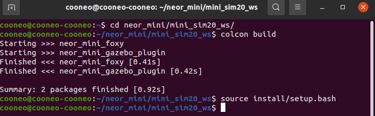
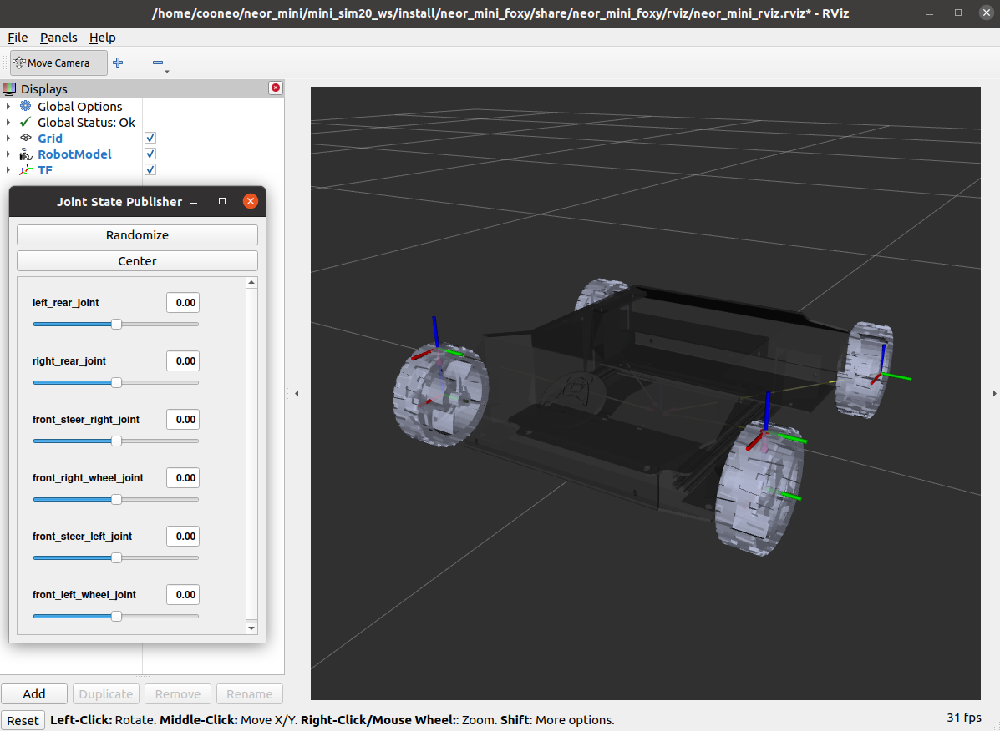
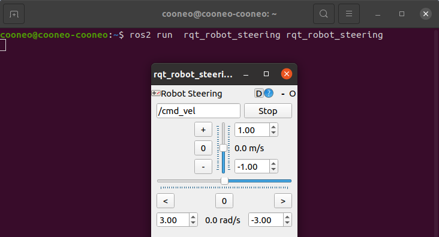
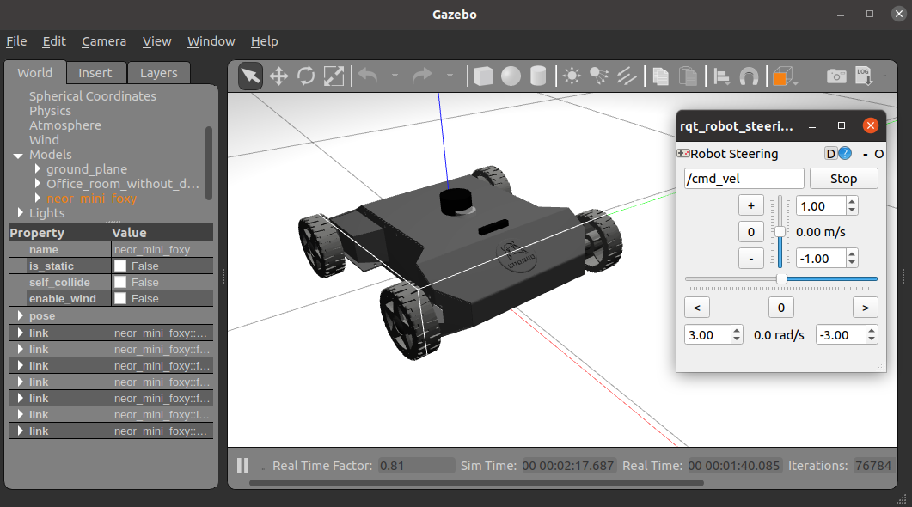

#### 准备工作 :

​    ubuntu 20.04 + ROS2 - foxy - desktop 

​    gazebo11

​    rviz2

#### chapter 1 : load neor_mini urdf file into rviz by ROS2 - foxy

##### Step 1 : down load code && compile its.

```bash
# open a new Terminal
git clone -b foxy https://github.com/cooneo/neor_mini.git


# after download neor_mini_foxy project.
cd neor_mini/mini_sim20_ws

# auto install dependence packages by packages.xml file or one by one by your hand
rosdep install -i --from-path src --rosdistro foxy -y

# compile ROS packages
colcon build

# wait a moment && source ROS workspace
source install/setup.bash
```



##### Step 2 : launch file && load neor_mini urdf into rviz2

```
# Terminal same as up
ros2 launch neor_mini_foxy display.launch.py 
```



#### chapter 2 : load neor_mini urdf file into gazebo11 && drive it by topics

##### Step 1 : launch rqt_robot_steering  ROS node

```bash
# open a new terminal
ros2 run  rqt_robot_steering rqt_robot_steering
```



##### Step 2 : launch file && load neor_mini into gazebo11 and drive it.

```bash
# open a new terminal
cd neor_mini/mini_sim20_ws
colcon build
source install/setup.bash

# launch file
ros2 launch neor_mini_foxy neor_mini_gazebo.launch.py
```



