# Neor_mini Ackerman Mobile Base

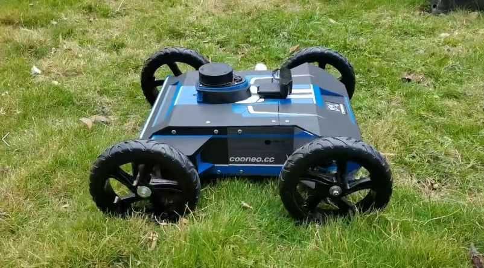


## Contents:

#### 	1.Neor mini Simulation Tutorials (neor_mini 全套仿真教程)

​		Chapter 1: Make a indoor autonomous mobile robot.

​		Chapter 2: Make a outdoor line-tracking mobile robot.

​		Chapter 3: Velodyne-16 && Lego_LOAM 3D Mapping. 		

​	    Chapter 4:  Simulation of Automatic Obstacle Avoidance Based on Three-channel Ultrasonic.				

​		Chapter 5:  Send the Goal to navigation through the ROS node.

​		Chapter 6: Hector_mapping 

​		Chapter 7: rf2o_laser_odometry && gmapping

Related folders（相关目录）:

​		**mini_sim18_ws && original_neor_mini**

​				

#### 	2.Raspberry Pi camera calibration (树莓派摄像头校准)

​	Related folders（相关目录）:

​		**calib_camera**

​	

#### 	3.Raspberry Pi camera recognition and ranging (树莓派单目摄像头目标检测与测距)

​	Related folders（相关目录）:		

​		**Object_detection _&&_ Distence**


#### 	4.Neor_min_ROS_Tutorials (neor_mini ROS 入门及进阶教程)

​	Related folders（相关目录）:		

​		**Neor_min_ROS_Tutorials**


## Chapter 1: Make a indoor autonomous mobile robot

### 	Corresponding WeChat article

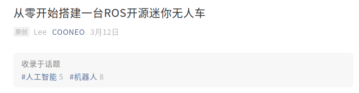


Developing Environments:

```bash
ubuntu 18.04 + ROS Melodic desktop full 
```

Explaination:

```bash
mini_sim18_ws                               #   this folder is ROS Workspace, you can run launchs and look at every demo.
original_neor_mini                       #    this folder is an original neor_mini urdf file, you can construction by yourself 
pictures                                              #    the total process pictures
```


Neor mini Simulation in Gazebo with ROS, Follow below steps:

Step 1:

```bash
# open your Terminal
git clone https://github.com/COONEO/neor_mini.git
cd neor_mini/mini_sim18_ws
rosdep install --from-paths src --ignore-src -r -y     # you need wait a moment
catkin_make                              
```


###  if   "catkin_make "  error,please install the dependencey of lego_loam(See chapter 3). or remove  LeGO-LOAM folder.


You can see 5 ROS packages in mini_sim18_ws/src folder,lists:

```bash
neor_mini                           # Storing the description of neor mini's appearance with urdf file
steer_drive_ros                # Ackermann kinematics ROS plugins
steer_mini_gazebo         # Storing the launch files of neor mini model visual in Gazebo
mini_gmapping                # Storing the launch files and gmapping params files
mini_navigation               # Storing the launch file and navigation params files
```


Step 2: launch neor_mini's launch file, visualize the urdf in Rviz.

```bash
# show the neor_mini.urdf in Rviz
cd ~/neor_mini/mini_sim18_ws
source devel/setup.bash
roslaunch neor_mini display.launch
```


```bash
#show the neor_mini_gazebo_sensors.urdf in Rviz
cd ~/neor_mini/mini_sim18_ws
source devel/setup.bash
roslaunch neor_mini display_gazebo_sensors.launch
```


Step 3: launch steer_mini_gazebo's launch file. visualize the urdf in Gazebo and try to control neor_mini .

```bash
#show the neor_mini_gazebo.urdf in Gazebo
cd ~/neor_mini/mini_sim18_ws
source devel/setup.bash
roslaunch steer_mini_gazebo steer_mini_sim.launch
```


```bash
#show the neor_mini_gazebo_sensors.urdf in Gazebo
cd ~/neor_mini/mini_sim18_ws
source devel/setup.bash
roslaunch steer_mini_gazebo steer_mini_sim_sensors.launch
```


Step 4 : Gmapping with neor_mini urdf

```bash
# launch gmapping_steer_mini_sim.launch file and construction map
cd ~/neor_mini/mini_sim18_ws
source devel/setup.bash
roslaunch mini_gmapping gmapping_steer_mini_sensors.launch
```


When you think the construction map is finished, Open a new terminal, you can run the below command to save the map.

```bash
cd ~/neor_mini/mini_sim18_ws/
source devel/setup.bash
cd src/mini_gmapping/map
rosrun map_server map_saver -f cooneo_office_map      # You can saved as another name
```


Step 5 : Using cooneo_office_map to make a navigation demo.

```bash
cd ~/neor_mini/mini_sim18_ws/
source devel/setup.bash
roslaunch mini_navigation navigation_steer_mini_sensors.launch                           # start a navigation demo
```


When you run up the list launch file, your monitor will show two windows, one is Rviz, another is Gazebo. looking at the rviz window up toolbar, you need to click "2D Nav Goal", and select a navigation goal on the map, soon the neor_mini model car will plan a route, and arrived.


## Chapter 2: Make a outdoor line-tracking mobile robot

### 	Corresponding WeChat article


step 1 : Copy Gazebo-world from neor_mini_linetrack/models folder

```bash
# open a Terminal
cp -r ~/neor_mini/mini_sim18_ws/src/neor_mini_linetrack/models/* ~/.gazebo/models/
```

and you will see four new folder in your ./gazebo/models folder as follows:


Step 2 : launch neor_mini_linetrack package launch file

```bash
# open a Terminal 
cd ~/neor_mini/mini_sim18_ws/
catkin_make                                                         # compile you all ros node in you workspace
source devel/setup.bash
roslaunch neor_mini_linetrack neor_mini_linetrack_day.launch
```

and you will see:


Step 3: rosrun line-tracking python node

```bash
# open a Terminal
cd ~/neor_mini/mini_sim18_ws/
source devel/setup.bash
rosrun neor_mini_linetrack line_follower_object.py
```

and you will see four new windows ,it's like this:


Congratulations!!! you will see the neor_mini urdf model running automatically using the data from the camera. 


## Chapter 3: Velodyne-16 && Lego_LOAM 3D Mapping

### 	Corresponding WeChat article


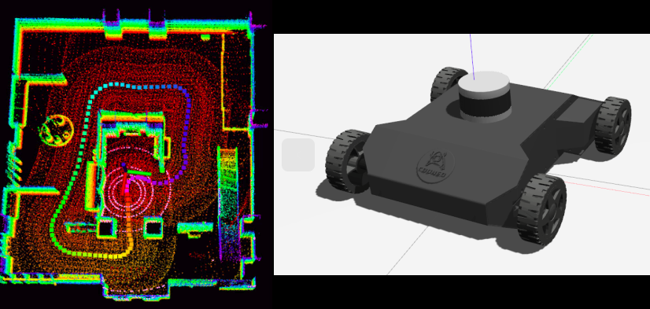


### Lego_loam url:  https://github.com/RobustFieldAutonomyLab/LeGO-LOAM

### install gtsam(Georgia Tech Smoothing and Mapping library, 4.0.0-alpha2)

```bash
#open a Terminal.
wget -O ~/Downloads/gtsam.zip https://github.com/borglab/gtsam/archive/4.0.0-alpha2.zip
cd ~/Downloads/ && unzip gtsam.zip -d ~/Downloads/
cd ~/Downloads/gtsam-4.0.0-alpha2/
mkdir build && cd build
cmake ..
sudo make install
```


Step 1: launch velodyne_simulator ROS package,and you will see:

```bash
# open a Terminal
cd ~/neor_mini/mini_sim18_ws/     
source devel/setup.bash

# launch VLP-16
roslaunch velodyne_description velodyne_16.launch
```

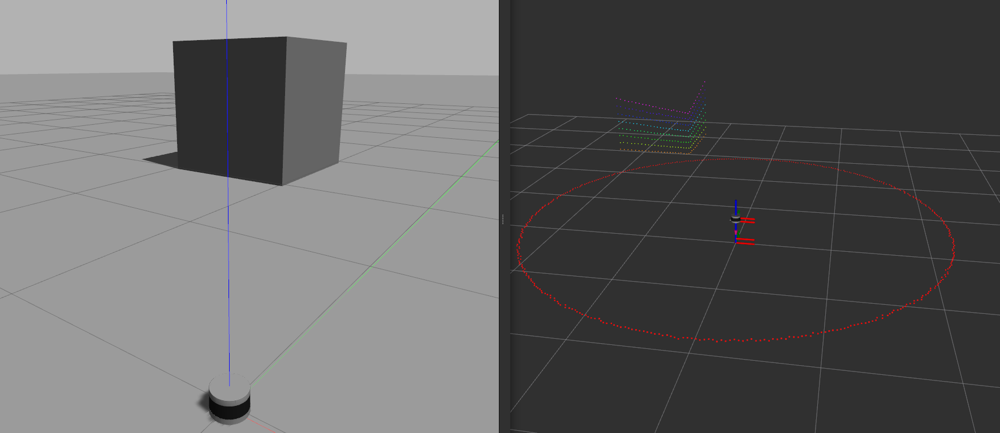


Step 2: Install the Velodyne-16 on the neor_mini

```bash
# open a Terminal
cd ~/neor_mini/mini_sim18_ws/     
source devel/setup.bash

# start launch file and see neor_mini + vlp-16 in Rviz
roslaunch neor_mini display_gazebo_sensors_VLP16.launch
```

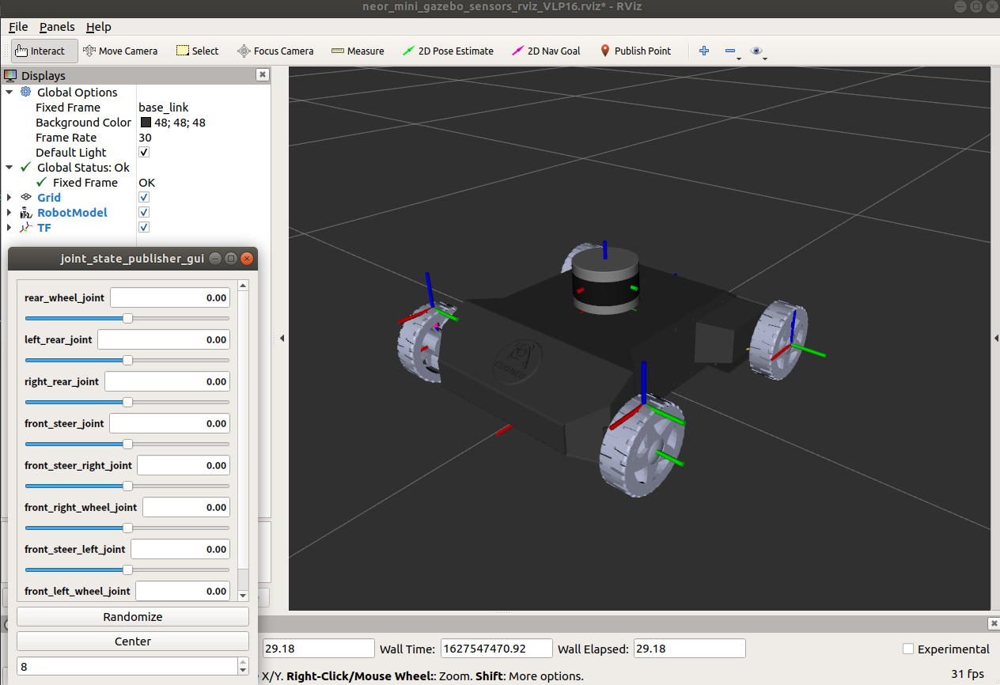


Step 3: launch the neor_mini+vlp16 model in Gazebo

```bash
# open a Terminal and add the museum model world into Gazebo's model folder
cp -r ~/neor_mini/mini_sim18_ws/src/neor_mini/models/* ~/.gazebo/models/

# open a Terminal
cd ~/neor_mini/mini_sim18_ws/     
source devel/setup.bash

# start launch file and see neor_mini + vlp-16 in Gazebo
roslaunch steer_mini_gazebo steer_mini_sim_sensors_VLP16.launch 
```

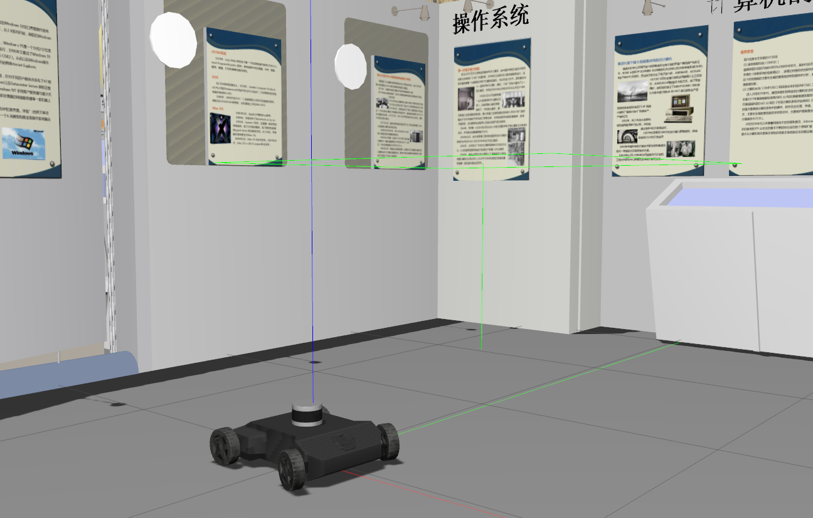

*(Gazebo from: iscas_museum.world )*


Step 4: Record the data collected by VLP-16 in Gazebo

```bash
# open a Terminal
cd ~/neor_mini/mini_sim18_ws/     
source devel/setup.bash
roslaunch steer_mini_gazebo steer_mini_sim_sensors_VLP16.launch 

# open another Terminal and record VLP-16 data By rosbag
cd ~/neor_mini/mini_sim18_ws/     
rosbag record -a

# and then, control the neor_mini traverses the iscas_museum world
```

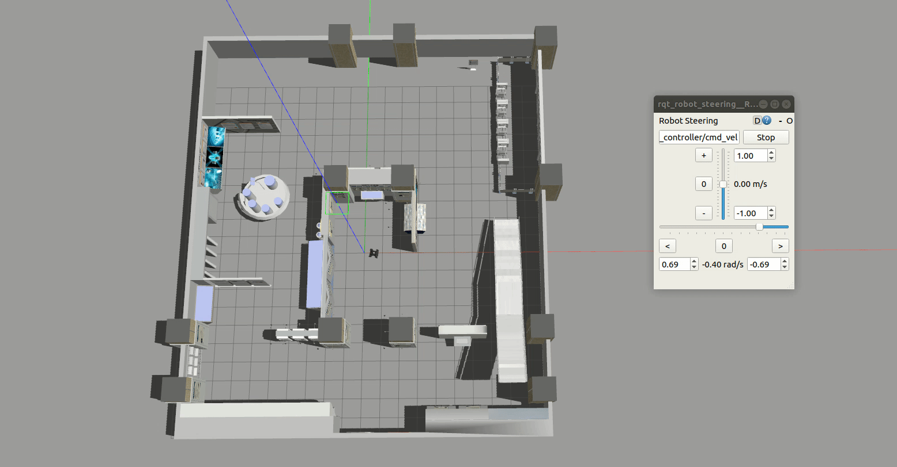


Step 5: Play the Record data && Mapping by Lego_Loam

```bash
# open a Terminal
cd ~/neor_mini/mini_sim18_ws/     
source devel/setup.bash
 roslaunch lego_loam run.launch 
 
 # open another Terminal and "cd" in your bag file folder
 cd ~/neor_mini/mini_sim18_ws/     
source devel/setup.bash
rosbag play  ####.bag         # replace with your own or current bag file's name

# and then,you will see mapping by Leog_loam
```

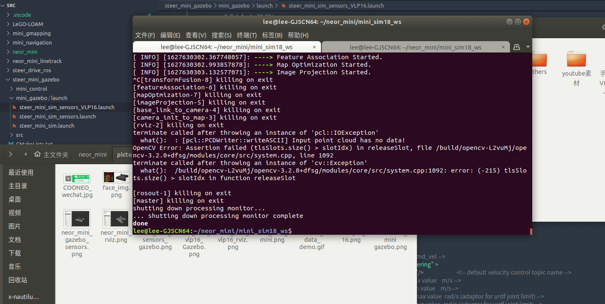

Congratulations!!! You can run Velodyne-16 Lidar in Gazebo with neor_mini and Mapping by Lego_Loam. 


The Lego_loam ROS Package from The RobustFieldAutonomyLab.

```bash
@inproceedings{legoloam2018,
  title={LeGO-LOAM: Lightweight and Ground-Optimized Lidar Odometry and Mapping on Variable Terrain},
  author={Shan, Tixiao and Englot, Brendan},
  booktitle={IEEE/RSJ International Conference on Intelligent Robots and Systems (IROS)},
  pages={4758-4765},
  year={2018},
  organization={IEEE}
}
```


## Chapter 4:  Simulation of Automatic Obstacle Avoidance Based on Three-channel Ultrasonic

### 	Corresponding WeChat article


step 1: Visualization of neor_mini after adding an ultrasonic sensor.

```bash
# open a Terminal
cd ~/neor_mini/mini_sim18_ws/     
source devel/setup.bash            # if failed,please catkin_make all packages

# launchUltrasonars sensors
roslaunch neor_mini display_gazebo_sensors_ultrasonars.launch
```

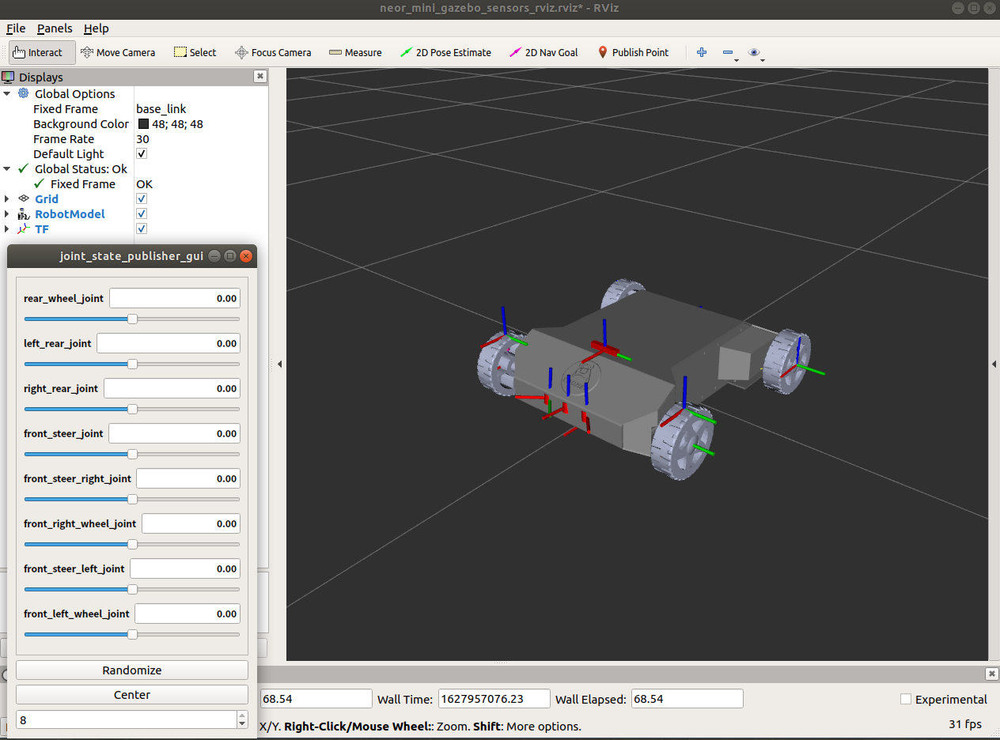


step 2: Start ultrasonic obstacle avoidance simulation in Gazebo (Stop step one)

```bash
# open one Terminal
cd ~/neor_mini/mini_sim18_ws/     
source devel/setup.bash            # if failed,please catkin_make all packages

roslaunch steer_mini_gazebo steer_mini_sim_sensors_ultrasonars.launch 
```

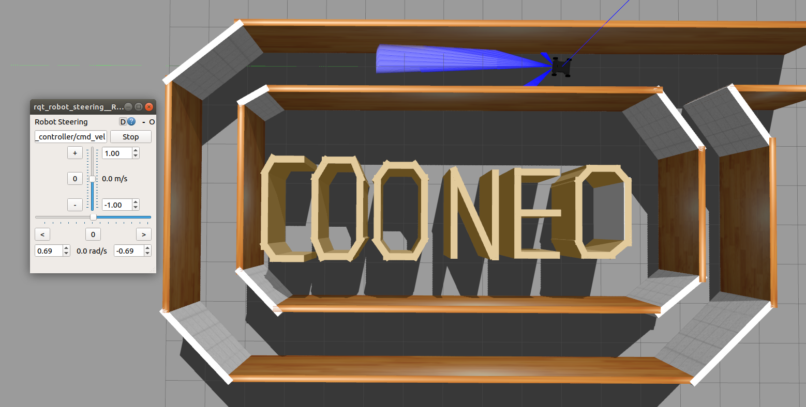																																									

```bash
# open another Terminal
cd ~/neor_mini/mini_sim18_ws/     
source devel/setup.bash            # if failed,please catkin_make all packages

# launch the ultra_avoid_obstacle node
roslaunch ultra_avoid_obstacle ultra_avoid_obstacle_node.launch 
```


Congratulations!!! 


## Chapter 5:  Send the Goal to navigation through the ROS node

### Corresponding WeChat article

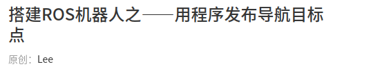

Step 1 : launch mini_navigation launch file.

```bash
# open a terminal
cd ~/neor_mini/mini_sim18_ws
catkin_make
source devel/setup.bash
roslaunch mini_navigation navigation_steer_mini_sensors.launch
```


Step 2 : rosrun the send_goals ROS node.

```bash
# open another terminal "ctrl + shift +t" (Recommend)
source devel/setup.bash 
rosrun send_goals send_goals_node
```

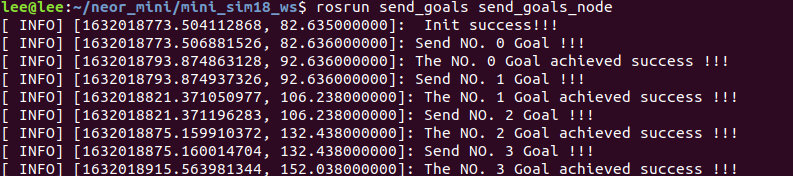

Congratulations!!! 


## Chapter 6: Hector_mapping 

Corresponding WeChat article

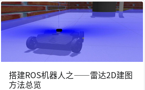

Step 1 : launch hector_mapping.launch 

```bash
# # open a terminal
cd ~/neor_mini/mini_sim18_ws
rosdep install --from-paths src --ignore-src -r -y     # you need wait a moment
catkin_make
source devel/setup.bash
roslaunch mini_gmapping hector_mapping.launch
```


Congratulations!!! 

Details paper:

```bash
@INPROCEEDINGS{KohlbrecherMeyerStrykKlingaufFlexibleSlamSystem2011,
  author = {S. Kohlbrecher and J. Meyer and O. von Stryk and U. Klingauf},
  title = {A Flexible and Scalable SLAM System with Full 3D Motion Estimation},
  year = {2011},
  month = {November},
  booktitle = {Proc. IEEE International Symposium on Safety, Security and Rescue Robotics (SSRR)},
  organization = {IEEE},
}
```


## Chapter 7: rf2o_laser_odometry && gmapping

Corresponding WeChat article


Step 1 : Find neor_mini_gazebo_sensors.urdf file, and replace the lidar scan frequency with 5. 

```xml
# the detiles blow: cd neor_mini/mini_sim18_ws/src/neor_mini/urdf && vim neor_mini_gazebo_sensors.urdf
...
<gazebo reference="laser_link">
  <sensor type="ray" name="Top_laser_sensor">
    <visualize>false</visualize>   <!-- visual or unvisual laser ray :true or false-->
    <update_rate>40</update_rate> <!-- 默认是 40，修改为 5 Hz -->
...
```


Step 2 : Find the steer_mini_sim_sensors_with_other_world.launch , and replace the world file with "cooneo_rooom2.world"

```xml
# cd neor_mini/mini_sim18_ws/src/steer_mini_gazebo/mini_gazebo/launch 
# vim steer_mini_sim_sensors_with_other_world.launch
<!--Load the surrounding environment into Gazebo-->
<include file="$(find gazebo_ros)/launch/empty_world.launch" >
    <arg name="world_name" value="$(find neor_mini)/worlds/cooneo_room2.world"/> 
</include>
...
```


Step 3 : launch rf2o_laser_odometry and gmapping node.

```bash
#open a terminal
cd ~/neor_mini/mini_sim18_ws
rosdep install --from-paths src --ignore-src -r -y     # you need wait a moment
catkin_make
source devel/setup.bash
roslaunch mini_gmapping laser_odom_gmapping.launch
```


Congratulations!!! 

Thinks for [MAPIRlab](https://github.com/MAPIRlab)/**[rf2o_laser_odometry](https://github.com/MAPIRlab/rf2o_laser_odometry)**  !!!


​																																		      2021.010.13     

​																																		author:ZhaoXiang Li

COONEO Co.,Ltd

Web:http://cooneo.cc

E: cooneo@outlook.com


For more details,you can search "COONEO" in your WeChat.


For more tutorials'video, please search "COONEO" in your Bilibili App.


# neor_mini
